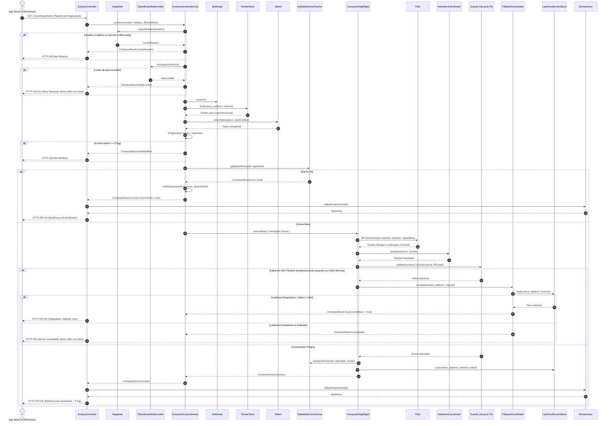
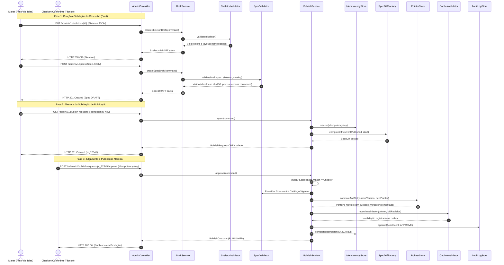
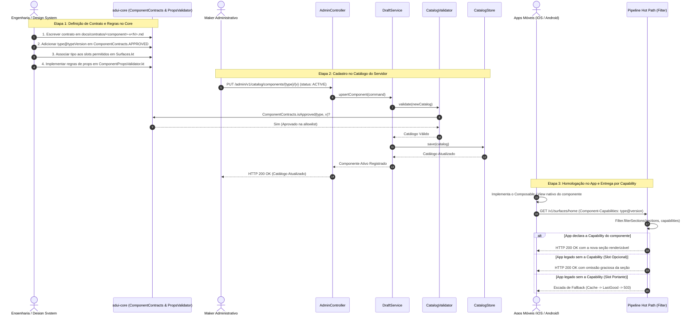

# ms-sdui-composer — Server-Driven UI BFF

Serviço orquestrador e compositor **Server-Driven UI (SDUI)** para aplicações móveis nativas (**iOS** e **Android**).
O `ms-sdui-composer` atua como **Presentation + Application Controller + BFF de UI** (Martin Fowler), compondo
árvores de componentes hidratadas, determinísticas e compatíveis a partir de especificações versionadas, capabilities
homologadas e contexto dinâmico do cliente móvel.

---

## 📋 Sumário

- [Visão Geral e Arquitetura](#-visão-geral-e-arquitetura)
- [Fluxos de Sequência e Responsabilidades das Classes](#-fluxos-de-sequência-e-responsabilidades-das-classes)
  - [1. Fluxo Completo de Composição no Hot Path (Runtime)](#1-fluxo-completo-de-composição-no-hot-path-runtime)
  - [2. Fluxo de Criação e Publicação de Telas (Governança Maker-Checker)](#2-fluxo-de-criação-e-publicação-de-telas-governança-maker-checker)
  - [3. Fluxo de Criação e Homologação de Novos Componentes](#3-fluxo-de-criação-e-homologação-de-novos-componentes)
- [Escopo do Serviço e Superfícies Elegíveis](#-escopo-do-serviço-e-superfícies-elegíveis)
- [Montagens Variáveis e Skeletons Suportados](#-montagens-variáveis-e-skeletons-suportados)
- [Design System Nativo e Ausência de Atributos Visuais](#-design-system-nativo-e-ausência-de-atributos-visuais)
- [Stack Tecnológica e Baseline](#-stack-tecnológica-e-baseline)
- [Estrutura de Módulos](#-estrutura-de-módulos)
- [Como Subir a Aplicação Localmente](#-como-subir-a-aplicação-localmente)
    - [Pré-requisitos](#pré-requisitos)
    - [Subindo via Gradle Wrapper](#subindo-via-gradle-wrapper)
    - [Subindo via JAR Executável](#subindo-via-jar-executável)
    - [Subindo via Docker Compose](#subindo-via-docker-compose)
    - [Configurações e Variáveis de Ambiente](#configurações-e-variáveis-de-ambiente)
- [Como Realizar Chamadas (Exemplos Práticos)](#-como-realizar-chamadas-exemplos-práticos)
    - [1. Endpoint Principal da Home (Hot Path)](#1-endpoint-principal-da-home-hot-path)
    - [2. Endpoint da Surface de Catálogo](#2-endpoint-da-surface-de-catálogo)
    - [3. Chamada Condicional com ETag (HTTP 304)](#3-chamada-condicional-com-etag-http-304)
    - [4. Validação Estrita de Headers (HTTP 400)](#4-validação-estrita-de-headers-http-400)
    - [5. Escada de Fallback e Resiliência (HTTP 503 e Degradação Graciosa)](#5-escada-de-fallback-e-resiliência-http-503-e-degradação-graciosa)
- [Governança Administrativa (Maker-Checker)](#-governança-administrativa-maker-checker)
    - [Ciclo de Publicação de Especificações](#ciclo-de-publicação-de-especificações)
    - [Rollback Atômico com Idempotência](#rollback-atômico-com-idempotência)
    - [Consulta de Auditoria](#consulta-de-auditoria)
- [Validação, Testes e Qualidade](#-validação-testes-e-qualidade)
- [Documentação Canônica de Referência](#-documentação-canônica-de-referência)

---

## 🏛️ Visão Geral e Arquitetura

O serviço opera de forma estritamente **stateless no hot path**: não consulta domínios de negócio regulados
diretamente, não retém sessões de usuário e não persiste árvores hidratadas no MongoDB.

### Pipeline de Composição no Hot Path

```
[Request HTTP GET /v1/surfaces/{surface}] (ex.: /home, /catalog)
                  │
                  ▼
         1. NEGOTIATE ── Validação obrigatória de 6 cabeçalhos contratuais.
                  │      Parsing de SemVer ordinal protegido contra overflow.
                  ▼
         2. SELECT    ── Seleção determinística da Spec publicada por plataforma,
                  │      canal (stable/canary/internal) e faixa de versão.
                  ▼
         3. FILTER    ── Omissão graciosa de seções incompatíveis com capabilities.
                  │      Ordenação estável TimSort O(N log N).
                  ▼
         4. HYDRATE   ── Hidratação pass-through na thread ou fan-out em Virtual
                  │      Threads delimitado por Semaphore e cancelamento ativo.
                  ▼
         5. GUARD     ── Proteção estrutural: VisualGuard (anti-CSS) e PiiGuard (anti-PII).
                  │      Se slot portante falhar: Escada de Fallback (Cache -> LastGood -> 503).
                  ▼
         6. COMPOSE   ── Serialização direta em ByteArray, geração de ETag e resposta HTTP.
```

---

## 🔄 Fluxos de Sequência e Responsabilidades das Classes

Esta seção apresenta os diagramas de sequência detalhados para os três ciclos vitais do `ms-sdui-composer`,
identificando com precisão a classe que inicia cada fluxo e a responsabilidade de cada classe participante.

### 1. Fluxo Completo de Composição no Hot Path (Runtime)

Representa o ciclo de vida completo de uma requisição de leitura disparada por um cliente móvel nativo (iOS ou Android)
ao solicitar a árvore de componentes de uma surface (ex.: `GET /v1/surfaces/home` ou `GET /v1/surfaces/catalog`).

#### Quem Inicia o Fluxo

> **Classe Inicial:** [`SurfaceController`](sdui-app/src/main/kotlin/br/com/empresa/sdui/api/http/SurfaceController.kt)
> É a porta de entrada REST HTTP de leitura. Recebe a chamada do app móvel com os cabeçalhos de negociação, valida
> condicionalmente a ETag e delega a orquestração para o pipeline interno de composição.

#### Diagrama de Sequência Mermaid (Hot Path)



#### Para que Serve Cada Classe do Fluxo Hot Path

| Classe / Componente                                                                                                   | Onde Fica (Pacote / Arquivo)                     | Para que Serve (Responsabilidade no Fluxo)                                                                                                                                                                                                               |
|-----------------------------------------------------------------------------------------------------------------------|--------------------------------------------------|----------------------------------------------------------------------------------------------------------------------------------------------------------------------------------------------------------------------------------------------------------|
| [`SurfaceController`](sdui-app/src/main/kotlin/br/com/empresa/sdui/api/http/SurfaceController.kt)                     | `br.com.empresa.sdui.api.http`                   | **Ponto de entrada HTTP**. Recebe requisições REST nas rotas `/v1/surfaces/home` e `/v1/surfaces/catalog`, encaminha cabeçalhos e devolve a resposta como `ByteArray` direto (passo único de serialização) para evitar double-serialization no hot path. |
| [`CorrelationIdFilter`](sdui-app/src/main/kotlin/br/com/empresa/sdui/api/http/CorrelationIdFilter.kt)                 | `br.com.empresa.sdui.api.http`                   | **Filtro de Rastreabilidade**. Captura ou gera o identificador de correlação (`x-correlation-id`) e popula o MDC dos logs em cada requisição.                                                                                                            |
| [`Negotiate`](sdui-core/src/main/kotlin/br/com/empresa/sdui/core/negotiate/Negotiate.kt)                              | `br.com.empresa.sdui.core.negotiate`             | **Validador de Contrato HTTP**. Faz o parsing defensivo dos 6 cabeçalhos obrigatórios do cliente móvel e converte a versão SemVer ordinal com segurança contra *integer overflow*.                                                                       |
| [`TokenBucketRateLimiter`](sdui-core/src/main/kotlin/br/com/empresa/sdui/core/limit/TokenBucket.kt)                   | `br.com.empresa.sdui.core.limit`                 | **Proteção contra Sobrecarga**. Avalia a taxa de requisições por coorte (`plataforma:build`) utilizando o algoritmo Token Bucket com atomicidade por chave (`compute`) sem travas globais.                                                               |
| [`ComposeScreenService`](sdui-app/src/main/kotlin/br/com/empresa/sdui/orchestrator/compose/ComposeScreenService.kt)   | `br.com.empresa.sdui.orchestrator.compose`       | **Orquestrador Central**. Conduz o pipeline completo de composição, gerenciando o orçamento temporal (`TimeBudget`), isolamento de concorrência, consulta de caches e acionamento de fallback.                                                           |
| [`Bulkhead`](sdui-core/src/main/kotlin/br/com/empresa/sdui/core/limit/Bulkhead.kt)                                    | `br.com.empresa.sdui.core.limit`                 | **Isolamento de Recursos**. Semáforo de contenção de concorrência de leitura que protege o serviço contra exaustão de conexões e colapso sob alta concorrência.                                                                                          |
| [`PointerStore`](sdui-app/src/main/kotlin/br/com/empresa/sdui/orchestrator/port/outbound/Stores.kt)                   | `br.com.empresa.sdui.orchestrator.port.outbound` | **Resolução de Versão Ativa**. Fornece o ponteiro (`Pointer`) que define qual identificador de revisão (`specRevisionId`) está em produção para a surface, plataforma e canal solicitados.                                                               |
| [`Select`](sdui-core/src/main/kotlin/br/com/empresa/sdui/core/select/Select.kt)                                       | `br.com.empresa.sdui.core.select`                | **Motor de Targeting**. Seleciona de forma determinística a especificação de tela mais adequada para o aplicativo com base na versão do app, versão do sistema operacional e canal.                                                                      |
| [`HydratedScreenCache`](sdui-app/src/main/kotlin/br/com/empresa/sdui/orchestrator/port/outbound/Stores.kt)            | `br.com.empresa.sdui.orchestrator.port.outbound` | **Cache de Árvore Pronta**. Armazena árvores já compostas e filtradas, chaveadas por revisão e hash de capacidades (`capsHash`). No acerto (`hit`), reidrata apenas campos voláteis do cliente (`withRequester`).                                        |
| [`ComposeSingleflight`](sdui-app/src/main/kotlin/br/com/empresa/sdui/adapters/memory/InMemoryStores.kt)               | `br.com.empresa.sdui.adapters.memory`            | **Deduplicação de Requisições Concorrentes**. Agrupa requisições simultâneas idênticas em torno de um único líder de computação. Se um waiter sofrer timeout local, ele degrada isoladamente sem interromper o líder compartilhado.                      |
| [`Filter`](sdui-core/src/main/kotlin/br/com/empresa/sdui/core/filter/Filter.kt)                                       | `br.com.empresa.sdui.core.filter`                | **Filtragem e Ordenação Estável**. Remove graciosamente seções cujos componentes não sejam suportados pelas capabilities do cliente móvel e reordena as seções pelo layout do skeleton via TimSort estável $O(N \log N)$.                                |
| [`HydrationCoordinator`](sdui-app/src/main/kotlin/br/com/empresa/sdui/orchestrator/hydration/HydrationCoordinator.kt) | `br.com.empresa.sdui.orchestrator.hydration`     | **Coordenador de Hidratação Dinâmica**. Dispara o enriquecimento de dados em tempo de execução via pass-through local ou fan-out assíncrono delimitado por semáforo em Virtual Threads Java 25.                                                          |
| [`Guards`](sdui-core/src/main/kotlin/br/com/empresa/sdui/core/validate/Guards.kt)                                     | `br.com.empresa.sdui.core.validate`              | **Guardiões Estruturais e de Segurança**. `VisualGuard` impede qualquer propriedade de estilo CSS/visual nas props e `PiiGuard` veta termos regulados ou dados sensíveis (CPF, senhas, tokens). Também valida slots portantes obrigatórios.              |
| [`FallbackCoordinator`](sdui-app/src/main/kotlin/br/com/empresa/sdui/orchestrator/compose/FallbackCoordinator.kt)     | `br.com.empresa.sdui.orchestrator.compose`       | **Escada de Degradação (ADR-007)**. Intercepta falhas graves de dependências ou esvaziamento de slots portantes (`header` e `accounts`), servindo a última tela válida ou emitindo HTTP 503 com `Retry-After` com jitter.                                |
| [`LastGoodScreenStore`](sdui-app/src/main/kotlin/br/com/empresa/sdui/orchestrator/port/outbound/Stores.kt)            | `br.com.empresa.sdui.orchestrator.port.outbound` | **Armazém de Emergência**. Retém a última composição bem-sucedida da surface (com validade de até 24h) para evitar telas em branco para os usuários.                                                                                                     |
| [`DomainJson`](sdui-app/src/main/kotlin/br/com/empresa/sdui/adapters/json/DomainJson.kt)                              | `br.com.empresa.sdui.adapters.json`              | **Serializador Jackson 3 Otimizado**. Serializa o envelope montado diretamente em bytes UTF-8 (`ByteArray`), eliminando reflexão e sobrecarga no retorno HTTP.                                                                                           |

---

### 2. Fluxo de Criação e Publicação de Telas (Governança Maker-Checker)

Descreve como uma nova tela ou revisão de layout é criada por um autor (`MAKER`), validada contra as regras estruturais
e aprovada por um conferente independente (`CHECKER`).

#### Quem Inicia o Fluxo

> **Classe Inicial:** [`AdminController`](sdui-app/src/main/kotlin/br/com/empresa/sdui/api/admin/AdminController.kt)
> É a porta de entrada da API administrativa (`/admin/v1`). Recebe os comandos do autor e do conferente autenticados
> pelos cabeçalhos `Actor-Id` e `Actor-Role`, impondo limites de admissão e garantindo idempotência em mutações.

#### Diagrama de Sequência Mermaid (Governança)



#### Para que Serve Cada Classe do Fluxo de Criação de Telas

| Classe / Componente                                                                                           | Onde Fica (Pacote / Arquivo)                     | Para que Serve (Responsabilidade no Fluxo)                                                                                                                                                               |
|---------------------------------------------------------------------------------------------------------------|--------------------------------------------------|----------------------------------------------------------------------------------------------------------------------------------------------------------------------------------------------------------|
| [`AdminController`](sdui-app/src/main/kotlin/br/com/empresa/sdui/api/admin/AdminController.kt)                | `br.com.empresa.sdui.api.admin`                  | **Porta de Entrada Administrativa**. Expõe endpoints `/admin/v1/**` para manutenção de skeletons, specs, catálogo, pedidos de publicação, rollback e auditoria.                                          |
| [`AdminRequestLimitFilter`](sdui-app/src/main/kotlin/br/com/empresa/sdui/api/http/AdminRequestLimitFilter.kt) | `br.com.empresa.sdui.api.http`                   | **Proteção de Admissão**. Impõe teto estrito de tamanho de corpo (1MB, ADR-022) antes da desserialização e limita mutações concorrentes para preservar o banco.                                          |
| [`DraftService`](sdui-app/src/main/kotlin/br/com/empresa/sdui/orchestrator/admin/AdminServices.kt)            | `br.com.empresa.sdui.orchestrator.admin`         | **Gestão de Rascunhos**. Cria e atualiza skeletons e specs em estado `DRAFT`, impedindo a alteração in-place de versões já publicadas (imutabilidade estrita).                                           |
| [`SkeletonValidator`](sdui-core/src/main/kotlin/br/com/empresa/sdui/core/validate/SkeletonValidator.kt)       | `br.com.empresa.sdui.core.validate`              | **Validador de Esqueleto**. Garante que a ordem dos slots seja válida, que os slots portantes obrigatórios (`header` e `accounts`) estejam presentes e que os layouts dos slots sejam homologados.       |
| [`SpecValidator`](sdui-core/src/main/kotlin/br/com/empresa/sdui/core/validate/SpecValidator.kt)               | `br.com.empresa.sdui.core.validate`              | **Validador de Especificação**. Certifica que o `checksum` siga o formato `sha256:<hex>`, valida tipos contra o catálogo ativo, verifica required capabilities e confere integridade de actions e props. |
| [`PublishService`](sdui-app/src/main/kotlin/br/com/empresa/sdui/orchestrator/admin/AdminServices.kt)          | `br.com.empresa.sdui.orchestrator.admin`         | **Motor de Governança Maker-Checker**. Orquestra abertura, aprovação e rejeição de pedidos, exigindo conferente independente e executando a transição de estado da spec.                                 |
| [`SpecDiffFactory`](sdui-core/src/main/kotlin/br/com/empresa/sdui/core/diff/SpecDiffFactory.kt)               | `br.com.empresa.sdui.core.diff`                  | **Calculador de Diferenças Estruturais**. Computa o delta semântico entre duas revisões de uma spec (seções adicionadas, modificadas ou removidas) para apoiar a revisão do checker.                     |
| [`IdempotencyStore`](sdui-app/src/main/kotlin/br/com/empresa/sdui/orchestrator/port/outbound/Stores.kt)       | `br.com.empresa.sdui.orchestrator.port.outbound` | **Garantia de Não-Duplicação**. Reserva a chave de idempotência (`Idempotency-Key`), armazena o hash da requisição e reproduz o resultado anterior em caso de retries de rede.                           |
| [`PointerStore`](sdui-app/src/main/kotlin/br/com/empresa/sdui/orchestrator/port/outbound/Stores.kt)           | `br.com.empresa.sdui.orchestrator.port.outbound` | **Atualizador Atômico de Ponteiro**. Executa a troca de versão do ponteiro em produção através de compare-and-set atômico, impedindo conflitos concorrentes de publicação.                               |
| [`CacheInvalidator`](sdui-app/src/main/kotlin/br/com/empresa/sdui/orchestrator/admin/CacheInvalidator.kt)     | `br.com.empresa.sdui.orchestrator.admin`         | **Invalidação Transacional**. Publica eventos de invalidação para limpar o cache de árvore pré-composta e colocar lápide (*tombstone*) no last good da revisão substituída.                              |
| [`AuditLogStore`](sdui-app/src/main/kotlin/br/com/empresa/sdui/orchestrator/port/outbound/Stores.kt)          | `br.com.empresa.sdui.orchestrator.port.outbound` | **Trilha de Auditoria Append-Only**. Registra de forma indelével todos os eventos de governança com carimbo de tempo, identificador do operador, ação e IDs de revisão.                                  |
| [`RollbackService`](sdui-app/src/main/kotlin/br/com/empresa/sdui/orchestrator/admin/AdminServices.kt)         | `br.com.empresa.sdui.orchestrator.admin`         | **Reversão Emergencial Atômica**. Permite ao checker reverter o ponteiro da surface para uma revisão estável anterior instantaneamente em resposta a incidentes de produção.                             |

---

### 3. Fluxo de Criação e Homologação de Novos Componentes

Detalha a jornada completa para conceber, registrar e disponibilizar um novo componente visual Server-Driven UI
(`type@typeVersion`), desde a homologação de contrato até sua entrega aos aplicativos móveis.

#### Quem Inicia o Fluxo

> **No Código / Contrato:** Inicia nas definições centrais de contrato em `sdui-core` ([
`ComponentContracts`](sdui-core/src/main/kotlin/br/com/empresa/sdui/core/model/Surface.kt), [
`Surfaces`](sdui-core/src/main/kotlin/br/com/empresa/sdui/core/model/Surface.kt), [
`ComponentPropsValidator`](sdui-core/src/main/kotlin/br/com/empresa/sdui/core/validate/ComponentPropsValidator.kt)).
> **Na Operação de Catálogo:** Inicia no [
`AdminController.upsertComponent`](sdui-app/src/main/kotlin/br/com/empresa/sdui/api/admin/AdminController.kt) executado
> por um operador `MAKER` via `PUT /admin/v1/catalog/components/{type}/{version}`.

#### Diagrama de Sequência Mermaid (Componentes)



#### Para que Serve Cada Classe do Fluxo de Criação de Componentes

| Classe / Componente                                                                                                 | Onde Fica (Pacote / Arquivo)                     | Para que Serve (Responsabilidade no Fluxo)                                                                                                                                                                                         |
|---------------------------------------------------------------------------------------------------------------------|--------------------------------------------------|------------------------------------------------------------------------------------------------------------------------------------------------------------------------------------------------------------------------------------|
| [`ComponentContracts`](sdui-core/src/main/kotlin/br/com/empresa/sdui/core/model/Surface.kt)                         | `br.com.empresa.sdui.core.model`                 | **Allowlist Imutável de Componentes**. Registra formalmente todos os componentes aprovados (`APPROVED`). Impede que nomes livres ou componentes não homologados sejam inseridos no catálogo.                                       |
| [`Surfaces`](sdui-core/src/main/kotlin/br/com/empresa/sdui/core/model/Surface.kt)                                   | `br.com.empresa.sdui.core.model`                 | **Vocabulário de Superfícies e Slots**. Mapeia quais tipos de componentes são autorizados em cada slot e surface (ex.: `account_card` no slot `accounts`), evitando montagens estruturalmente incompatíveis.                       |
| [`ComponentPropsValidator`](sdui-core/src/main/kotlin/br/com/empresa/sdui/core/validate/ComponentPropsValidator.kt) | `br.com.empresa.sdui.core.validate`              | **Validador de Propriedades do Componente**. Valida as propriedades (`props`) de cada seção antes da publicação (campos obrigatórios, limites de texto, ausência de CSS e ações permitidas).                                       |
| [`AdminController`](sdui-app/src/main/kotlin/br/com/empresa/sdui/api/admin/AdminController.kt)                      | `br.com.empresa.sdui.api.admin`                  | **Borda REST de Catálogo**. Recebe a requisição `PUT /admin/v1/catalog/components/{type}/{version}` para ativar ou descontinuar o componente no ecossistema.                                                                       |
| [`DraftService`](sdui-app/src/main/kotlin/br/com/empresa/sdui/orchestrator/admin/AdminServices.kt)                  | `br.com.empresa.sdui.orchestrator.admin`         | **Serviço de Atualização de Catálogo**. Executa o upsert do componente no catálogo corrente e submete a nova estrutura agregada à validação estrita.                                                                               |
| [`CatalogValidator`](sdui-core/src/main/kotlin/br/com/empresa/sdui/core/validate/CatalogValidator.kt)               | `br.com.empresa.sdui.core.validate`              | **Guardião de Catálogo**. Veta qualquer inserção de componente que não possua contrato aprovado em `ComponentContracts.isApproved`, mesmo que em estado inativo.                                                                   |
| [`CatalogStore`](sdui-app/src/main/kotlin/br/com/empresa/sdui/orchestrator/port/outbound/Stores.kt)                 | `br.com.empresa.sdui.orchestrator.port.outbound` | **Armazenamento de Catálogo**. Persiste a lista oficial de tipos e versões homologadas em memória ou MongoDB para consulta das validações de governança.                                                                           |
| [`CapabilityMatrix`](sdui-core/src/main/kotlin/br/com/empresa/sdui/core/compat/CapabilityMatrix.kt)                 | `br.com.empresa.sdui.core.compat`                | **Matriz de Compatibilidade Móvel**. Gerencia o universo de capabilities conhecidas. Componentes novos **não** são concedidos automaticamente a nenhuma versão de app móvel, exigindo declaração ativa do cliente.                 |
| [`Filter`](sdui-core/src/main/kotlin/br/com/empresa/sdui/core/filter/Filter.kt)                                     | `br.com.empresa.sdui.core.filter`                | **Garantia de Entrega Segura no App**. No hot path, confronta a section com as capabilities declaradas pelo cliente móvel: se o app suportar, o componente é entregue; caso contrário, é omitido graciosamente sem quebrar a tela. |

---

## 🎯 Escopo do Serviço e Superfícies Elegíveis

O Server-Driven UI é uma ferramenta de **orquestração de apresentação dinâmica**, não um substituto para fluxos nativos
transacionais. O escopo do `ms-sdui-composer` é delimitado por princípios estritos de governança e segurança:

### Superfícies Elegíveis para SDUI

- **Home (`home`):** Superfície primária de entrada, agregação de produtos e atalhos dinâmicos.
- **Catálogo (`catalog`, ADR-020):** Vitrines de produtos, categorias, banners e prateleiras comerciais.
- **Hubs de Produtos e Campanhas Sazonais:** Vitrines com alta rotatividade de negócio sem necessidade de release nas
  lojas de aplicativos.

### Superfícies Estritamente Proibidas / Fora de Escopo

- ❌ **Autenticação, Login e Passcode:** Telas de entrada de credenciais, digitação de PIN, biometria ou validação de OTP
  devem ser 100% nativas por segurança bancária.
- ❌ **Onboarding e KYC Regulado:** Captura de documentos, biometria facial e termos legais exigem fluxo de validação
  estrito e determinístico no cliente nativo.
- ❌ **Checkout e Carrinho Transacional:** Fluxos de compra com cálculo de frete, aplicação de cupons concorrentes e
  cobrança requerem orquestração transacional de checkout dedicada.
- ❌ **Chat em Tempo Real e Atendimento:** Mensageria via WebSocket, push streams e threads de suporte são geridos por
  backends específicos de mensageria.
- ❌ **Mapas e Rastreamento em Tempo Real:** Mapas interativos, rotas GPS e telemetria contínua pertencem a SDKs nativos
  de geolocalização.

### Blindagem de Segurança e Ações Proibidas

1. **Zero PII no Hot Path:** Nenhuma seção ou propriedade pode trafegar dados sensíveis regulados (`cpf`, `token`,
   `password`, `pin`, `otp`, `passcode`, `cvv`).
2. **Conjunto Fechado de Actions:** Apenas intenções declarativas e auditáveis (`navigate`, `open_bottom_sheet`,
   `track`, `noop`). Ações de mutação arbitrária de rede como `callApi`, `addToCart` ou `completeOnboarding` são
   rejeitadas incondicionalmente no schema.

---

## 🧩 Montagens Variáveis e Skeletons Suportados

O `ms-sdui-composer` desacopla a **surface** do seu **layout estrutural**, permitindo que uma mesma surface (`home`)
possua múltiplas opções de montagem versionadas via skeletons canônicos:

| Skeleton               | Surface | Layout Raiz              | Ordem e Disposição dos Slots                                                                                                                                                                       | Caso de Uso Principal                                                                                  |
|:-----------------------|:-------:|:-------------------------|:---------------------------------------------------------------------------------------------------------------------------------------------------------------------------------------------------|:-------------------------------------------------------------------------------------------------------|
| **`home.default`**     | `home`  | `single_column_vertical` | 1. `header` (`fixed`)<br>2. `shortcuts` (`shelf`)<br>3. `accounts` (`list` - portante)<br>4. `cards` (`list`)<br>5. `offers` (`list`)<br>6. `coverage` (`list`)<br>7. `foryou` (`pager`)           | Layout clássico sequencial para usuários correntistas habituais.                                       |
| **`home.cards_first`** | `home`  | `single_column_vertical` | 1. `header` (`fixed`)<br>2. `cards` (`grid_2_columns`)<br>3. `shortcuts` (`shelf`)<br>4. `accounts` (`list` - portante)<br>5. `offers` (`list`)<br>6. `coverage` (`list`)<br>7. `foryou` (`pager`) | Foco em cartões de crédito e faturas, exibidos em grade de 2 colunas no topo logo abaixo do cabeçalho. |

### Exemplos Executáveis de Demonstração (`docs/examples/screens/`)

Para fins de demonstração e homologação, o repositório versiona composições adicionais:

- **`banking.shortcuts_first`:** Home com atalhos em destaque inicial.
- **`banking.cards_first`:** Home focada em cartões com grid de 2 colunas.
- **`banking.transactions`:** Home com slot de resumo de transações recentes (`transaction_summary@1`, ADR-020).
- **`fashion.catalog`:** Vitrine de produtos e categorias na surface `catalog` (`catalog_navigation@1`,
  `product_collection@1`, ADR-020).

### Vocabulário Fechado de Slots e Layouts Permitidos

Para impedir vazamento de CSS ou layouts arbitrários definidos no servidor, cada slot aceita apenas layouts homologados
pelo Design System nativo (`allowedLayouts`):

- `header`: `fixed`
- `shortcuts`: `shelf`, `grid_4_columns`
- `accounts`: `list`, `compact_card` (Slot portante obrigatório na Home)
- `cards`: `list`, `grid_2_columns`, `carousel`
- `offers`: `list`, `shelf`
- `coverage`: `list`, `compact_card`
- `foryou`: `pager`, `carousel`

---

## 🎨 Design System Nativo e Ausência de Atributos Visuais

O servidor Server-Driven UI é um provedor de **conteúdo estruturado e intenções**, **nunca** de estilo ou renderização:

- **Proibição de CSS e Geometria:** Nenhuma chave como `color`, `background`, `font`, `padding`, `margin`, `radius`,
  `width`, `height`, `orientation` é aceita em props de seções.
- **Proibição de Variantes Visuais:** A chave `variant` (ex.: `"compact"`) é expressamente proibida no payload e
  pertence à lista restrita de atributos visuais. Decisões de densidade visual e responsividade pertencem às classes
  de tamanho nativas (`WindowSizeClass` no Android e `SizeClass` no iOS).
- **Catálogo Canônico em `@1`:** 7 tipos homologados no MVP (`top_bar`, `shortcut_shelf`, `account_card`,
  `card_product`, `credit_offer`, `coverage_card`, `decision_card`) e 3 contratos propostos sob ADR-020
  (`transaction_summary@1`, `catalog_navigation@1`, `product_collection@1`).

---

## 🚀 Stack Tecnológica e Baseline

- **Linguagem:** Kotlin 2.4.20 (`allWarningsAsErrors = true`)
- **JVM / Plataforma:** Java 25 LTS via Gradle Toolchain (`jvmToolchain(25)`)
- **Framework:** Spring Boot 4.1.1 (Spring Framework 7.0.9 gerenciado pelo BOM oficial)
- **JSON:** Jackson 3 (`tools.jackson.core:jackson-databind` 3.1.5 + `tools.jackson.module:jackson-module-kotlin`)
- **Concorrência:** Spring MVC sobre **Virtual Threads Java 25** (`spring.threads.virtual.enabled: true`)
- **Persistência & Cache:** Padrão em memória. Opt-in com MongoDB 8.3+ (autoridade) e Redis (cache e fallback)
- **Governança Arquitetural:** ArchUnit 1.5.0 garantindo isolamento estrito entre camadas

---

## 📦 Estrutura de Módulos

```text
sdui-bootstrap        --> implementation(project(":sdui-app"))
sdui-app              --> api(project(":sdui-core"))
                      --> implementation(project(":sdui-contract"))
sdui-contract         --> Jackson 3 estrito apenas (DTOs de resposta)
sdui-core             --> JDK 25 e Kotlin stdlib apenas (Zero dependências externas)
sdui-integration-test --> testImplementation de todos os módulos + ArchUnit
```

- **`sdui-core`:** Puro. Regras de domínio, SemVer ordinal, validação de catálogo e skeleton, guards e token bucket.
- **`sdui-contract`:** DTOs de contrato público e envelopes JSON serializáveis com Jackson 3.
- **`sdui-app`:** Orquestrador de composição, hydration coordinator, adaptadores de persistência e controllers HTTP.
- **`sdui-bootstrap`:** Módulo executável Spring Boot com inicialização, beans e profiles.
- **`sdui-integration-test`:** Regras de arquitetura ArchUnit e testes end-to-end de isolamento.

---

## 💻 Como Subir a Aplicação Localmente

### Pré-requisitos

- **Java JDK 25 LTS** instalado e configurado no `PATH` (`JAVA_HOME`).
- Opcional: Docker / Rancher Desktop (para instâncias locais de MongoDB e Redis caso deseje o modo persistente).

### Subindo via Gradle Wrapper

A aplicação sobe por padrão em **modo memória com seed canônica ativada** (`sdui.seed-ios=true`), pronta para
atender chamadas imediatamente na porta `8080`.

**PowerShell (Windows):**

```powershell
.\gradlew.bat :sdui-bootstrap:bootRun
```

**Bash / Zsh (Linux / macOS):**

```bash
./gradlew :sdui-bootstrap:bootRun
```

### Subindo via JAR Executável

Para compilar e gerar o pacote de produção:

```powershell
# Compilação e empacotamento
.\gradlew.bat :sdui-bootstrap:bootJar

# Execução do JAR independente
java -jar .\sdui-bootstrap\build\libs\sdui-bootstrap.jar
```

Aguarde o log de inicialização do Spring Boot:

```text
Started SduiApplication in 0.852 seconds (process running for 1.15)
```

Para validar a integridade da aplicação:

<details>
<summary><b>Visualizar comando cURL de health check</b></summary>

```powershell
curl http://localhost:8080/actuator/health
# {"status":"UP"}
```

</details>

### Subindo via Docker Compose

O arquivo `compose.yaml` disponibiliza **MongoDB 8.3** (em replica set `rs0` na porta 27017) e **Redis 8** (na porta

6379)

para execução local de infraestrutura:

```bash
docker compose up -d
```

Por padrão, a aplicação sobe em **modo em memória local** (`sdui.persistence.store=memory` e
`sdui.persistence.cache=memory`).
O modo persistente é **opt-in** (ADR-021) e pode ser ativado apontando as variáveis de ambiente:

```bash
SDUI_PERSISTENCE_STORE=mongo
SDUI_PERSISTENCE_MONGO_URI=mongodb://localhost:27017/?replicaSet=rs0&directConnection=true
SDUI_PERSISTENCE_CACHE=redis
SDUI_PERSISTENCE_REDIS_URL=redis://localhost:6379
```

> **Atenção:** Em modo em memória, o estado vive no heap do processo. Uma segunda réplica não compartilha specs nem
> pointer, operando como instância única. Detalhes na Seção 8 de [
`docs/arquitetura-de-referencia.md`](docs/arquitetura-de-referencia.md#8-persistência-e-cache).

> **Atenção:** O plano administrativo (`/admin/v1/**`) não possui autenticação por token — o papel do ator vem
> do cabeçalho `Actor-Role`. O serviço não deve ser exposto publicamente sem um API Gateway autenticador à frente.

### Configurações e Variáveis de Ambiente

As propriedades podem ser customizadas via `application.yaml` ou variáveis de ambiente com o prefixo `SDUI_`:

| Propriedade                                       |  Padrão   | Descrição                                                                 |
|---------------------------------------------------|:---------:|---------------------------------------------------------------------------|
| `server.port`                                     |  `8080`   | Porta HTTP da aplicação                                                   |
| `spring.threads.virtual.enabled`                  |  `true`   | Habilita concorrência com Virtual Threads Java 25                         |
| `sdui.seed-ios`                                   |  `true`   | Carrega o catálogo MVP e a fixture canônica da Home iOS no startup        |
| `sdui.tree-ttl-seconds`                           |   `60`    | TTL do cache de tela pré-composta (memória ou Redis)                      |
| `sdui.tree-cache-max-entries`                     |  `10000`  | Teto de árvores no cache de composição em memória                         |
| `sdui.hydration-timeout-ms`                       |   `80`    | Timeout individual de hidratação remota de section                        |
| `sdui.hydration-fanout`                           |    `8`    | Limite de seções hidratadas concorrentemente por requisição               |
| `sdui.request-budget-ms`                          |  `1000`   | Orçamento total da requisição; limita esperas no pipeline (ADR-014)       |
| `sdui.singleflight-timeout-ms`                    |   `150`   | Espera máxima de waiters pelo líder no singleflight antes do fallback     |
| `sdui.read-bulkhead-permits`                      |   `32`    | Teto de concorrência simultânea do plano de leitura (bulkhead)            |
| `sdui.read-bulkhead-wait-ms`                      |   `50`    | Espera máxima por permissão no bulkhead de leitura antes de degradar      |
| `sdui.max-fallback-age-seconds`                   |  `86400`  | Idade máxima do last good servido como fallback (24h)                     |
| `sdui.retry-after-seconds`                        |    `5`    | Valor base do Retry-After para HTTP 503 (com jitter de ±40%)              |
| `sdui.rate-limit-retry-after-seconds`             |    `2`    | Valor base do Retry-After para HTTP 429 (com jitter de ±40%)              |
| `sdui.rate-limit-capacity`                        |  `10000`  | Capacidade do Token Bucket por coorte/cliente                             |
| `sdui.rate-limit-refill-per-second`               |  `10000`  | Taxa de reabastecimento de tokens por segundo do rate limiter             |
| `sdui.rate-limit-max-keys`                        | `100000`  | Teto de buckets residentes no rate limiter                                |
| `sdui.idempotency-ttl-seconds`                    |  `86400`  | Validade de uma chave de idempotência administrativa (24h)                |
| `sdui.idempotency-max-keys`                       |  `10000`  | Teto de chaves de idempotência residentes em memória                      |
| `sdui.idempotency-reservation-timeout-seconds`    |   `300`   | Reserva em voo mais velha que isto é tratada como abandonada              |
| `sdui.admin-max-body-bytes`                       | `1048576` | Teto do payload administrativo antes da desserialização (1MB, ADR-022)    |
| `sdui.admin-max-concurrent-requests`              |    `8`    | Limite de mutações administrativas concorrentes simultâneas (ADR-022)     |
| `sdui.metrics-max-tag-values`                     |   `64`    | Teto de valores distintos por tag nas métricas próprias                   |
| `sdui.demo-enabled`                               |  `false`  | Publica os quatro exemplos de `docs/examples/screens` (nunca em produção) |
| `sdui.persistence.store`                          | `memory`  | `memory` ou `mongo` (ADR-021); `mongo` exige `SDUI_PERSISTENCE_MONGO_URI` |
| `sdui.persistence.cache`                          | `memory`  | `memory` ou `redis` (ADR-021); `redis` exige `SDUI_PERSISTENCE_REDIS_URL` |
| `sdui.persistence.invalidation-relay-interval-ms` |  `5000`   | Intervalo do relay de invalidação de cache/last good                      |
| `sdui.canary-ios-builds`                          |   `[]`    | Lista de builds de iOS autorizadas para canal Canary                      |
| `sdui.canary-android-builds`                      |   `[]`    | Lista de builds de Android autorizadas para canal Canary                  |

---

### Medição de Performance e Carga

- `./gradlew :sdui-app:perfHarness`: Executa o harness in-process comparando latências e alocações de memória para
  seleção de specs, hidratação pass-through e caches residentes.
- `./gradlew :sdui-app:loadTest -PbaseUrl=http://localhost:8080`: Executa o cenário HTTP de alta concorrência
  `load/compose-hit-p99.yaml` contra uma instância ativa do serviço, validando throughput (req/s) e percentis P95/P99 de
  resposta.

---

## 📡 Como Realizar Chamadas (Exemplos Práticos)

O BFF Server-Driven UI exige **6 cabeçalhos de negociação obrigatórios** para garantir que a composição entregue a
árvore correta para a plataforma e versão do aplicativo.

### 1. Endpoint Principal da Home (Hot Path)

#### Cabeçalhos Obrigatórios

| Cabeçalho           | Exemplo  | Descrição                                                  |
|---------------------|----------|------------------------------------------------------------|
| `API-Version`       | `1`      | Versão da API REST HTTP                                    |
| `UI-Schema-Version` | `3`      | Versão da estrutura de envelope SDUI (v3 no MVP)           |
| `Client-Platform`   | `ios`    | Plataforma nativa do cliente (`ios` ou `android`)          |
| `Client-Version`    | `8.10.0` | Versão SemVer com 3 partes numéricas (`major.minor.patch`) |
| `Client-Build`      | `1234`   | Número da compilação do aplicativo (apenas dígitos)        |
| `Accept-Language`   | `pt-BR`  | Idioma primário do cliente                                 |

#### Cabeçalhos Opcionais

- `OS-Version`: Versão do sistema operacional (ex.: `17.5.1`).
- `Component-Capabilities`: Lista de componentes suportados pelo cliente (ex.:
  `top_bar@1,shortcut_shelf@1,account_card@1`).
- `SDUI-Channel`: Canal solicitado (`stable`, `canary` ou `internal`). Padrão: `stable`.
- `If-None-Match`: ETag da última tela recebida para validação de cache.

#### Exemplo de Chamada com cURL

<details>
<summary><b>Visualizar comando cURL (GET /v1/surfaces/home)</b></summary>

```bash
curl -X GET http://localhost:8080/v1/surfaces/home \
  -H "API-Version: 1" \
  -H "UI-Schema-Version: 3" \
  -H "Client-Platform: ios" \
  -H "Client-Version: 8.10.0" \
  -H "Client-Build: 1234" \
  -H "Accept-Language: pt-BR" \
  -H "OS-Version: 17.5.1" \
  -H "SDUI-Channel: stable" \
  -i
```

</details>

#### Exemplo de Resposta: HTTP 200 OK

```json
{
  "envelope": {
    "surface": "home",
    "platform": "ios",
    "schemaVersion": "3",
    "specRevisionId": "rev_01K8HOMEMAIN",
    "skeletonId": "home.default",
    "skeletonHash": "sha256:7c2b0e1a9d4f6a8c3e5b1d0f2a4c6e8b",
    "etag": "W/\"rev_01K8HOMEMAIN-ios-3-ad4e3e6a255a\"",
    "generatedAt": "2026-09-19T15:30:00.000-03:00",
    "locale": "pt-BR",
    "channel": "stable",
    "fallback": false,
    "fallbackReason": "none",
    "omitted": [],
    "client": {
      "platform": "ios",
      "appVersion": "8.10.0",
      "build": "1234",
      "osVersion": "17.5.1",
      "schemaVersionRequested": "3"
    },
    "targeting": {
      "platform": "ios",
      "appVersionMin": "8.10.0",
      "appVersionMax": "8.19.99",
      "osVersionMin": "16.0",
      "schemaVersion": "3",
      "band": "current"
    },
    "analytics": {
      "event": "sdui_home_composed",
      "surface": "home",
      "platform": "ios",
      "experience": "home_ios_current",
      "schemaVersion": "3",
      "specRevisionId": "rev_01K8HOMEMAIN",
      "sectionCount": 7,
      "fallback": false
    }
  },
  "skeleton": {
    "id": "home.default",
    "layout": "single_column_vertical",
    "slots": [
      {
        "id": "header",
        "layout": "fixed",
        "title": null
      },
      {
        "id": "shortcuts",
        "layout": "shelf",
        "title": null
      },
      {
        "id": "accounts",
        "layout": "list",
        "title": "Conta"
      },
      {
        "id": "cards",
        "layout": "list",
        "title": "Cartão de crédito"
      },
      {
        "id": "offers",
        "layout": "list",
        "title": "Crédito"
      },
      {
        "id": "coverage",
        "layout": "list",
        "title": "Seguros"
      },
      {
        "id": "foryou",
        "layout": "pager",
        "title": "Para você"
      }
    ]
  },
  "sections": [
    {
      "id": "sec_header_v1",
      "slot": "header",
      "type": "top_bar",
      "typeVersion": 1,
      "layout": null,
      "props": {
        "greeting": "Olá, Cliente"
      },
      "actions": [],
      "analytics": {
        "event": "sdui_section_shown",
        "component": "top_bar",
        "componentVersion": 1,
        "slot": "header",
        "sectionId": "sec_header_v1",
        "specRevisionId": "rev_01K8HOMEMAIN"
      }
    }
  ]
}
```

---

### 2. Endpoint da Surface de Catálogo

Para obter a tela de catálogo comercial (`catalog`, ADR-020):

<details>
<summary><b>Visualizar comando cURL (GET /v1/surfaces/catalog)</b></summary>

```bash
curl -X GET http://localhost:8080/v1/surfaces/catalog \
  -H "API-Version: 1" \
  -H "UI-Schema-Version: 3" \
  -H "Client-Platform: ios" \
  -H "Client-Version: 8.10.0" \
  -H "Client-Build: 1234" \
  -H "Accept-Language: pt-BR" \
  -H "Component-Capabilities: catalog_navigation@1,product_collection@1" \
  -i
```

</details>

---

### 3. Chamada Condicional com ETag (HTTP 304)

Quando o cliente já possui a tela em cache, envia o cabeçalho `If-None-Match`:

<details>
<summary><b>Visualizar comando cURL condicional com ETag (HTTP 304)</b></summary>

```bash
curl -X GET http://localhost:8080/v1/surfaces/home \
  -H "API-Version: 1" \
  -H "UI-Schema-Version: 3" \
  -H "Client-Platform: ios" \
  -H "Client-Version: 8.10.0" \
  -H "Client-Build: 1234" \
  -H "Accept-Language: pt-BR" \
  -H "If-None-Match: W/\"rev_01K8HOMEMAIN-ios-3-ad4e3e6a255a\"" \
  -i
```

</details>

**Resposta HTTP 304 Not Modified:**

```http
HTTP/1.1 304 Not Modified
ETag: W/"rev_01K8HOMEMAIN-ios-3-ad4e3e6a255a"
Cache-Control: private, max-age=60
Vary: API-Version, UI-Schema-Version, Client-Platform, Client-Version, Client-Build, Component-Capabilities
```

---

### 4. Validação Estrita de Headers (HTTP 400)

Se qualquer cabeçalho obrigatório faltar ou for inválido:

<details>
<summary><b>Visualizar comando cURL com headers ausentes (HTTP 400)</b></summary>

```bash
curl -X GET http://localhost:8080/v1/surfaces/home \
  -H "API-Version: 1" \
  -H "Client-Platform: ios" \
  -i
```

</details>

**Resposta HTTP 400 Bad Request:**

```json
{
  "code": "INVALID_HEADERS",
  "message": "headers de negociacao invalidos",
  "details": [
    "UI-Schema-Version:required",
    "Client-Version:required",
    "Client-Build:required",
    "Accept-Language:required"
  ]
}
```

---

### 5. Escada de Fallback e Resiliência (HTTP 503 e Degradação Graciosa)

Se ocorrer indisponibilidade temporária de dependências ou ausência de spec compatível, o serviço percorre a **Escada
Determinística de Fallback**:

1. **`200 OK` (Composição Regular):** Árvore completa montada com sucesso.
2. **`200 OK` com Omissão Graciosa:** Seções opcionais com falha são omitidas (slots portantes `header` e `accounts` são
   protegidos).
3. **`200 OK` com `fallback: true` (Last Good):** Se um slot portante falhar, serve a última composição válida cacheada
   (`sdui.max-fallback-age-seconds` = 86400s).
4. **`503 Service Unavailable`:** Caso o last good expire ou não exista, responde com indisponibilidade controlada:

```http
HTTP/1.1 503 Service Unavailable
Retry-After: 6
Content-Type: application/json

{
  "code": "COMPOSE_UNAVAILABLE",
  "message": "home indisponivel",
  "details": ["no_compatible_spec"]
}
```

> **Nota de Resiliência:** O valor de `Retry-After` aplica jitter pseudoaleatório de ±40% sobre a base
> configurada (`sdui.retry-after-seconds`), dispersando as tentativas de retry das coortes móveis e impedindo o efeito
> de manada (*thundering herd*).

---

## 🛡️ Governança Administrativa (Maker-Checker)

Toda alteração de catálogo, skeleton ou especificação passa por governança estrita **Maker-Checker**:

- `Actor-Id`: Identificador do usuário administrativo.
- `Actor-Role`: Papel do usuário (`MAKER`, `CHECKER` ou `AUDITOR`).
- **Regra:** O criador de um draft de spec (`MAKER`) não pode aprovar a publicação para si mesmo nos canais `canary` e
  `stable`.

### Ciclo de Publicação de Especificações

#### 1. Criar Rascunho de Spec (Maker)

<details>
<summary><b>Visualizar comando cURL para criação de rascunho de spec (POST /admin/v1/specs)</b></summary>

```bash
curl -X POST http://localhost:8080/admin/v1/specs \
  -H "Content-Type: application/json" \
  -H "Actor-Id: joao.maker" \
  -H "Actor-Role: MAKER" \
  -d '{
    "specId": "spec_home_ios_v2",
    "revision": 1,
    "specRevisionId": "spec_home_ios_v2#1",
    "surface": "home",
    "platform": "ios",
    "channel": "stable",
    "skeletonId": "home.default",
    "skeletonRevision": 1,
    "targeting": {
      "platform": "ios",
      "appVersion": { "min": { "major": 8, "minor": 20, "patch": 0 }, "max": null },
      "schemaVersion": { "min": { "major": 3, "minor": 0, "patch": 0 }, "max": null },
      "requiredCapabilities": [{ "type": "top_bar", "typeVersion": 1 }],
      "priority": 100,
      "band": "next"
    },
    "sections": [
      {
        "id": "sec_header_v1",
        "slot": "header",
        "type": "top_bar",
        "typeVersion": 1,
        "props": { "greeting": "Olá" },
        "actions": []
      },
      {
        "id": "sec_acc_v1",
        "slot": "accounts",
        "type": "account_card",
        "typeVersion": 1,
        "props": { "title": "Conta Principal" },
        "actions": []
      }
    ],
    "checksum": "sha256:7c2b0e1a9d4f6a8c3e5b1d0f2a4c6e8b",
    "experience": "home_v2"
  }'
```

</details>

#### 2. Abrir Solicitação de Publicação (Maker)

<details>
<summary><b>Visualizar comando cURL de solicitação de publicação (POST /admin/v1/publish-requests)</b></summary>

```bash
curl -X POST http://localhost:8080/admin/v1/publish-requests \
  -H "Content-Type: application/json" \
  -H "Actor-Id: joao.maker" \
  -H "Actor-Role: MAKER" \
  -H "Idempotency-Key: idemp_pub_001" \
  -d '{
    "specId": "spec_home_ios_v2",
    "revision": 1,
    "channel": "stable"
  }'
```

</details>

#### 3. Aprovar Publicação (Checker)

<details>
<summary><b>Visualizar comando cURL de aprovação de publicação (POST /admin/v1/publish-requests/{id}/approve)</b></summary>

```bash
curl -X POST http://localhost:8080/admin/v1/publish-requests/pr_12345/approve \
  -H "Actor-Id: maria.checker" \
  -H "Actor-Role: CHECKER" \
  -H "Idempotency-Key: idemp_app_001"
```

</details>

---

### Rollback Atômico com Idempotência

Para reverter instantaneamente o ponteiro de uma surface para a revisão estável anterior:

<details>
<summary><b>Visualizar comando cURL de rollback de ponteiro (POST /admin/v1/pointers/...:rollback)</b></summary>

```bash
curl -X POST http://localhost:8080/admin/v1/pointers/home/ios/stable:rollback \
  -H "Content-Type: application/json" \
  -H "Actor-Id: maria.checker" \
  -H "Actor-Role: CHECKER" \
  -H "Idempotency-Key: idemp_rollback_001" \
  -d '{ "reason": "Incidente em producao - retorno para revisao estavel anterior" }'
```

</details>

---

### Consulta de Auditoria

Consulta append-only de todos os eventos de governança:

<details>
<summary><b>Visualizar comando cURL de consulta de auditoria (GET /admin/v1/audit)</b></summary>

```bash
curl -X GET http://localhost:8080/admin/v1/audit \
  -H "Actor-Id: carlos.auditor" \
  -H "Actor-Role: AUDITOR"
```

</details>

---

## 🧪 Validação, Testes e Qualidade

O projeto adota política de **tolerância zero para warnings** (`allWarningsAsErrors = true`).

### Rodar Toda a Suíte de Testes

```powershell
.\gradlew.bat test --warning-mode=fail
```

### Rodar Testes de Arquitetura (ArchUnit)

Garante conformidade com Clean Architecture, pureza do `sdui-core` e ausência de `@Transactional`:

```powershell
.\gradlew.bat :sdui-integration-test:test --warning-mode=fail
```

### Validação Completa (Quality Gate)

```powershell
.\gradlew.bat clean check --warning-mode=fail
```

---

## 📚 Documentação Canônica de Referência

A documentação técnica detalhada do projeto está versionada na pasta [`docs/`](docs/README.md):

1. [`arquitetura-de-referencia.md`](docs/arquitetura-de-referencia.md) — Clean Architecture, convenções de engenharia,
   concorrência com Virtual Threads, pipeline, observabilidade, governança, matriz consolidada de decisões (ADR-001 a
   ADR-022) e histórico das histórias do MVP (H00–H18).
2. [`guia-depreciacao-e-migracao.md`](docs/guia-depreciacao-e-migracao.md) — Padrão Strangler para componentes, sunset
   de faixas de app e Expand/Contract no MongoDB.
3. [`guia-criacao-telas-componentes.md`](docs/guia-criacao-telas-componentes.md) — Guia prático de criação de novas
   telas, montagens e componentes via SDUI.

### Subdiretórios Estruturados

- [`docs/adr/`](docs/adr/README.md) — Matriz consolidada de decisões arquiteturais do serviço (ADR-001 a ADR-022).
- [`docs/contratos/`](docs/contratos/transaction-summary-v1.md) — Contratos propostos de novos componentes
  (`transaction_summary@1`, `catalog_navigation@1`, `product_collection@1`).
- [`docs/examples/screens/`](docs/examples/screens/README.md) — Quatro composições de exemplo executáveis (skeleton,
  spec e resposta esperada).
- [`docs/images/`](docs/images/README.md) — Catálogo de compatibilidade visual de telas móveis reais.
- [`docs/runbooks/`](docs/runbooks/) — Procedimentos operacionais para rollback de Canary
  ([iOS](docs/runbooks/ios-canary-rollback.md) e [Android](docs/runbooks/android-canary-rollback.md))
  e [Contrato de Retry para Clientes Móveis](docs/runbooks/contrato-de-retry-clientes-moveis.md).
- [Histórico do MVP (`H00`–
  `H18`)](docs/arquitetura-de-referencia.md#12-histórico-consolidado-de-histórias-do-mvp-h00h18) — Matriz consolidada de
  entrega das histórias do MVP (100% entregues e validadas).
- Fixtures canônicas e contratos oficiais versionados em [
  `sdui-contract/src/test/resources/fixtures/`](sdui-contract/src/test/resources/fixtures/)
  (`contrato-sdui-home-definitivo.json` e `contrato-sdui-home-cards-first.json`).
