# Fluxos de integração — ms-sdui-composer

**ms-sdui-composer** = o serviço que, a cada request, compõe a árvore de UI da surface a partir de uma spec versionada, do contexto do cliente e das capabilities, devolvendo um envelope pronto e seguro para o app.

> **Status:** proposta de arquitetura para alinhamento técnico.
>
> **Escopo:** `ms-sdui-composer` atendendo iOS e Android por meio de um **serviço consumidor/BFF Mobile** (com a Home como primeira surface). O `ms-sdui-composer` não é chamado diretamente pelo app neste desenho e não consulta domínios de negócio.

---

## 1. Visão geral

O Mobile chama o **Serviço Consumidor**, que autentica/orquestra a request e chama o **ms-sdui-composer**. O ms-sdui-composer compõe somente a estrutura e o conteúdo de apresentação permitidos no contrato; o Serviço Consumidor devolve o envelope ao Mobile.

O ms-sdui-composer é **stateless**. MongoDB é a fonte da verdade de catálogo, skeleton, specs, pointers, revisões, diffs e auditoria. Redis é cache de spec, árvore, projeções, singleflight e última árvore boa.

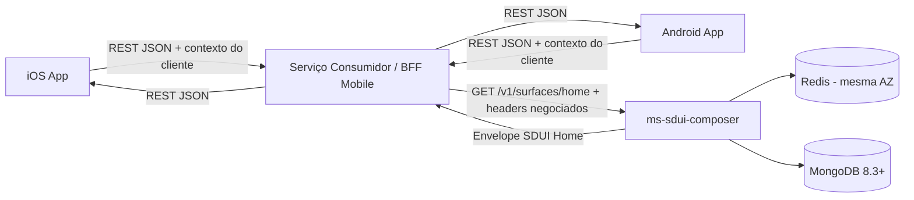

### Responsabilidades

| Camada | Responsabilidade | Não faz |
|---|---|---|
| Mobile iOS/Android | Envia identidade/capabilities, mantém cache local, renderiza sections conhecidas e despacha actions | Escolher spec, definir composição ou interpretar dados de domínio para a Home SDUI |
| Serviço Consumidor / BFF Mobile | Autentica, propaga contexto de negociação, chama o ms-sdui-composer e devolve a resposta ao app | Alterar, montar ou injetar sections no payload do SDUI sem contrato explícito |
| ms-sdui-composer | Negocia, seleciona, filtra, hidrata projeções de apresentação, envelopa, faz fallback e controla cache | Consultar contrato, cliente, apólice, sinistro ou outro domínio de negócio |
| MongoDB | Fonte da verdade de specs, catálogo, skeleton, pointers, revisão, diff, publish e auditoria | Servir árvore hidratada por usuário como cache |
| Redis | Cache e proteção de P99 | Guardar PII, dados regulados ou mídia binária |

---

## 2. Fluxo de request

O Serviço Consumidor deve propagar os headers de negociação sem criar nomes com prefixo `X-`. O contrato HTTP usa `API-Version` para a API do MS e `UI-Schema-Version` como eixo independente do contrato de UI.

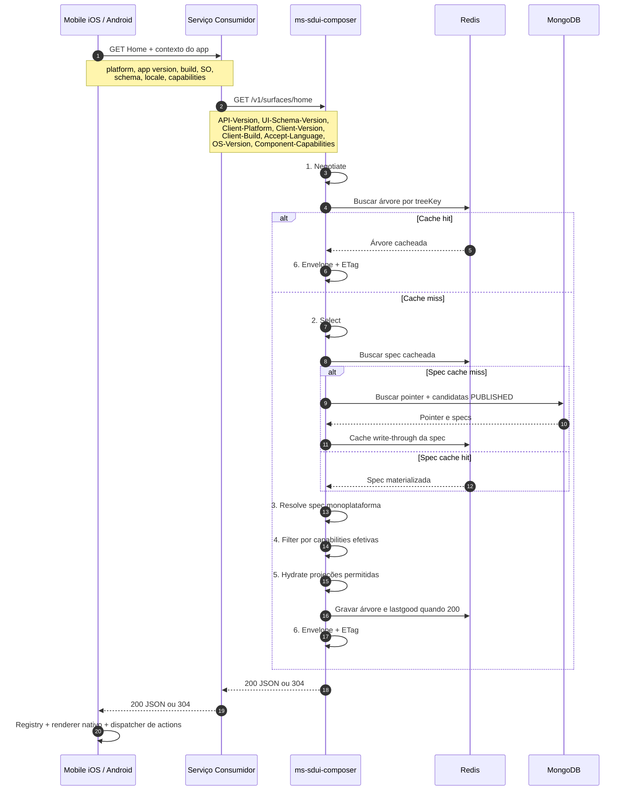

### Headers propagados pelo Serviço Consumidor

| Header | Obrigatório | Uso no SDUI |
|---|---:|---|
| `API-Version` | Sim | Versão HTTP do MS; no MVP é `1` |
| `UI-Schema-Version` | Sim | Versão do envelope/contrato UI |
| `Client-Platform` | Sim | `ios` ou `android`; escolhe a família de spec/pointer |
| `Client-Version` | Sim | Seleção por faixa semver da plataforma |
| `Client-Build` | Sim | Desempate e elegibilidade de canary |
| `Accept-Language` | Sim | Locale da copy já resolvida |
| `OS-Version` | Recomendado | Targeting fino por SO |
| `Component-Capabilities` | Recomendado | Delta de capabilities; não substitui a matriz do servidor |
| `If-None-Match` | Opcional | Revalidação da representação e retorno 304 |

> O Serviço Consumidor não deve alterar os valores de platform, versão, build, schema ou capabilities recebidos do Mobile. Se precisar validar autenticidade desses dados, essa validação pertence à sua borda de segurança antes da chamada ao SDUI.

---

## 3. Montagem da Home

A composição no MS segue sempre esta sequência. O composer não monta a tela a partir de dados de domínio no request quente; ele seleciona uma árvore previamente validada, remove sections não compatíveis e hidrata apenas projeções permitidas.

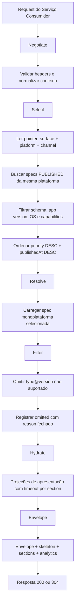

### Regras de sections

O catálogo Home MVP é semântico e compartilhado por iOS/Android:

```text
top_bar@1
shortcut_shelf@1
account_card@1
card_product@1
credit_offer@1
coverage_card@1
decision_card@1
```

O skeleton ordena os slots: `header`, `shortcuts`, `accounts`, `cards`, `offers`, `coverage` e `foryou`. Cada slot define `allowedTypes` e máximo de instâncias. Uma placement inválida é bloqueada no publish; uma section não suportada pelo cliente é omitida no compose.

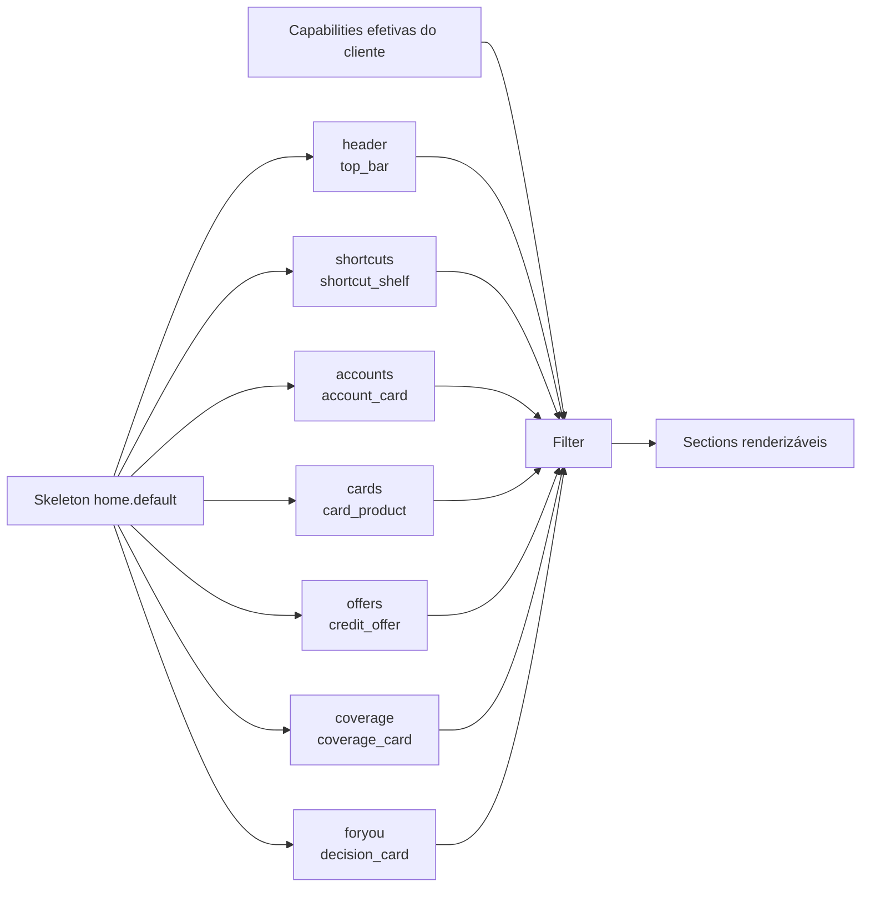

### Quando um componente não aparece

Uma section pode não aparecer na Home por dois motivos distintos:

1. **A spec não a posiciona:** não existe placement para aquele slot/type na revisão selecionada.
2. **O cliente não sabe renderizá-la:** `type@version` não pertence às capabilities efetivas; o MS a omite e preenche `envelope.omitted`.

Não é responsabilidade do Mobile escolher sections. O Mobile recebe o que é compatível com seu binário e renderiza apenas renderers compilados no app.

---

## 4. Versionamento e compatibilidade

Há três eixos independentes. Eles não devem ser reduzidos a um único inteiro, nem ligados por uma matriz combinatória de flags.

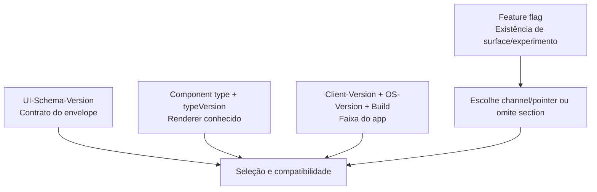

| Eixo | Exemplo | Regra |
|---|---|---|
| Schema | `UI-Schema-Version: 3` | Muda quando o envelope muda de forma incompatível |
| Component | `account_card@1` | Muda quando o renderer exige prop incompatível nova |
| App/OS | App `8.14.2`, Android `35` | Seleciona spec compatível por faixa da própria plataforma |
| Channel | `stable`, `canary`, `internal` | Seleciona pointer; não é feature flag nem versão de schema |

Form factor, breakpoint, densidade e rotação **não** são eixos. Não entram na seleção, não entram na chave de cache e não viram header. São decisão do cliente no momento do render.

### Seleção por plataforma

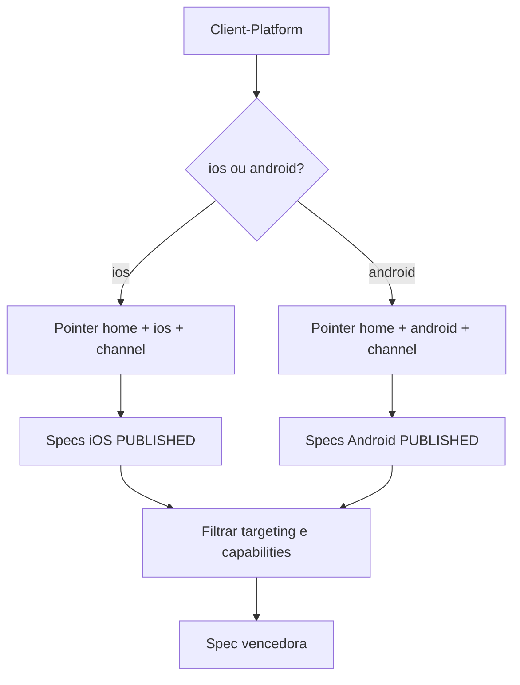

- iOS e Android compartilham catálogo, skeleton e regras de compose.
- iOS e Android possuem specs, faixas de versão, pointers, árvores cacheadas, canary e rollback independentes.
- Não comparar semver de iOS com Android.
- No MVP, a estratégia é **spec monoplataforma**, não base + overlay JSON Patch.

---

## 5. Cache, resiliência e fallback

Redis reduz latência e protege o Mongo. As chaves não têm `userId`, pois este MS não personaliza a Home por cliente.

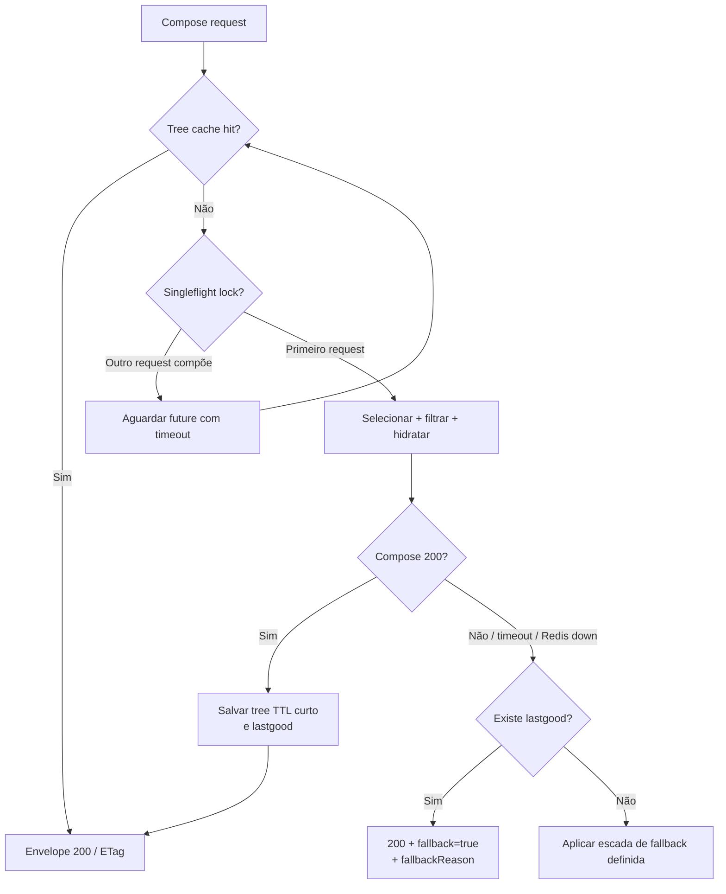

| Chave | Conteúdo | Regra principal |
|---|---|---|
| `sdui:spec:{specRevisionId}:{platform}` | Spec publicada/materializada | Write-through no approve; invalida por revisão |
| `sdui:tree:{surface}:{platform}:{schema}:{appMajorMinor}:{capsHash}:{channel}` | Árvore pronta para resposta | TTL curto, 30–90 s |
| `sdui:section:{proj}:{id}` | Projeção de section | TTL curto |
| `sdui:lastgood:{surface}:{platform}:{channel}` | Última árvore 200 válida | Usada em fallback |
| `sdui:sf:{treeKey}` | Coordenação de miss | Evita tempestade de composições |

### Regras de degradação

- Falha de uma section: omitir a section e responder com a tela restante.
- Timeout de hidratação: aplicar timeout por section, sem bloquear toda a Home.
- Miss lento ou Redis indisponível: usar `lastgood` quando disponível, com `fallback: true`.
- Targeting sem spec vigente: retornar 200 com última árvore boa e fallback; nunca 404 para `home`.
- Aprovação ou rollback: invalidar somente as chaves do `surface + platform + channel` e revisões afetadas; nunca executar flush global.

---

## 6. Persistência e governança

MongoDB mantém o ciclo de vida de configuração. O request de compose não modifica specs e não abre transação.

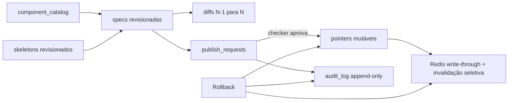

| Coleção | Papel |
|---|---|
| `component_catalog` | Contrato de cada `type + typeVersion` |
| `skeletons` | Estrutura e slots da Home |
| `specs` | Snapshot de placements, targeting e revisão |
| `pointers` | Revisão vigente por `surface + platform + channel` |
| `publish_requests` | Fluxo maker-checker |
| `diffs` | Diff estrutural entre revisões |
| `audit_log` | Trilha append-only de ações administrativas |
| `idempotency` | Protege approve e rollback contra repetição |

### Publish e rollback

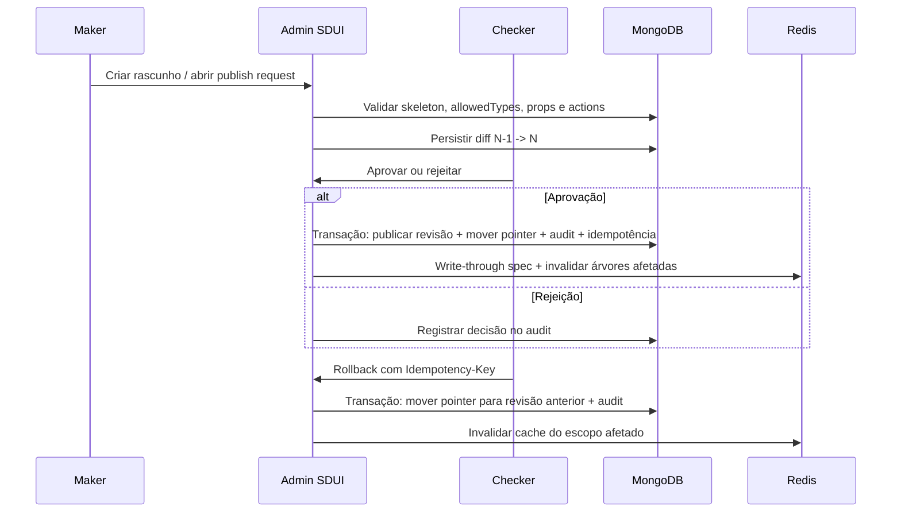

#### Invariantes

- Maker não aprova o próprio publish.
- Spec `PUBLISHED` é imutável.
- Rollback não edita JSON: move o pointer.
- Rollback iOS não altera Android; rollback Android não altera iOS.
- `@Transactional` pertence ao serviço de publish/rollback; não ao controller nem ao compose.

---

## 7. Canary e promoção

Canary é um channel com pointer próprio, não uma duplicação de contrato por flag.

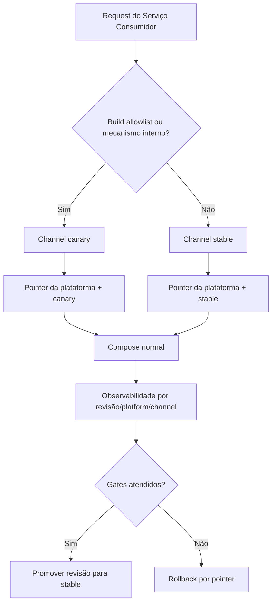

### Gates de promoção

- Compatibilidade do binário, schema e capabilities validada.
- Sem aumento operacional material de fallback ou erro.
- Compose em cache hit dentro da meta P99 de até 400 ms.
- SLO fim a fim acompanhado: rede + compose + first paint abaixo de 1200 ms no P99.
- Rollback testado e executável pelo checker autorizado.

---

## 8. Observabilidade

A observabilidade deve permitir identificar uma regressão por plataforma, canal, revisão, app e section sem registrar PII ou props completas.

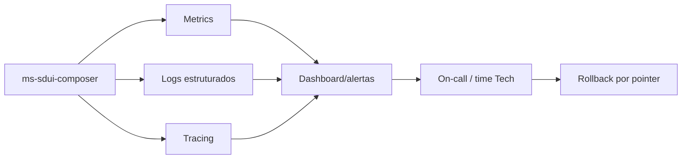

### Métricas mínimas

```text
compose.hit
compose.miss
compose.fallback
compose.singleflight.wait
payload.bytes
serialize.ms
section.<tipo>.ms
```

### Tags mínimas

```text
surface
platform
channel
schemaVersion
appVersion
specRevisionId
```

Não usar em métrica/log: nome, identificadores pessoais, valores financeiros individuais, payload integral ou dados regulados.

---

## 9. Fluxos de falha relevantes

### Section falha, Home continua

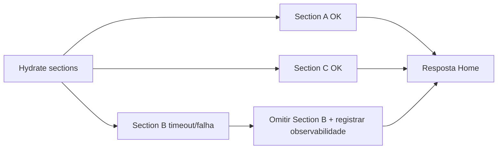

### Cliente não suporta componente

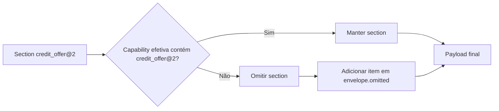

### Sem spec compatível

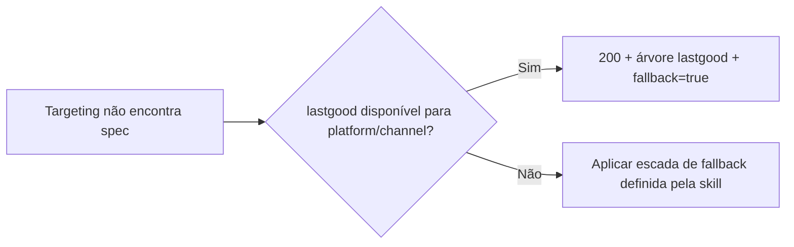

---

## 10. Decisões para o time

1. O Serviço Consumidor é a borda Mobile neste desenho; o ms-sdui-composer mantém contrato REST/JSON interno e não conversa com domínios.
2. O Serviço Consumidor **propaga** o contexto do app; não escolhe spec e não recompõe payload.
3. iOS e Android usam o mesmo endpoint e catálogo, mas têm specs, pointers, caches e rollbacks isolados.
4. O Mobile precisa implementar omit-unknown e manter renderers nativos compilados para o catálogo suportado.
5. Uma alteração de campo incompatível exige novo schema ou `typeVersion`, conforme o que mudou; não deve ser resolvida por flag.
6. Flags escolhem existência de superfície/experimento ou channel/pointer; não geram matriz `schema × componente × flag × plataforma`.
7. O payload é de apresentação: nenhum dado bruto regulado ou entidade de domínio deve atravessar o contrato SDUI.
8. Antes de produção, o contrato Android deve ser homologado pelo time Mobile Android; o contrato iOS existente é referência estrutural, não uma garantia de campos Android.

---

## 11. Checklist de apresentação

- [ ] Serviço Consumidor definido como caller do ms-sdui-composer e dono da borda Mobile
- [ ] Headers de negociação propagados sem `X-`
- [ ] Contract tests para iOS e Android
- [ ] Matriz de capabilities mantida no servidor por plataforma e versão do app
- [ ] Specs/pointers/cache/lastgood separados por plataforma e channel
- [ ] Maker-checker, diff, audit e idempotência ativos antes de canary
- [ ] ETag/304 e fallback testados
- [ ] SLO e métricas por section/revisão/platform/channel publicados
- [ ] Runbook de rollback validado para iOS e Android
- [ ] Contrato Android homologado antes de publicar spec Android em stable
